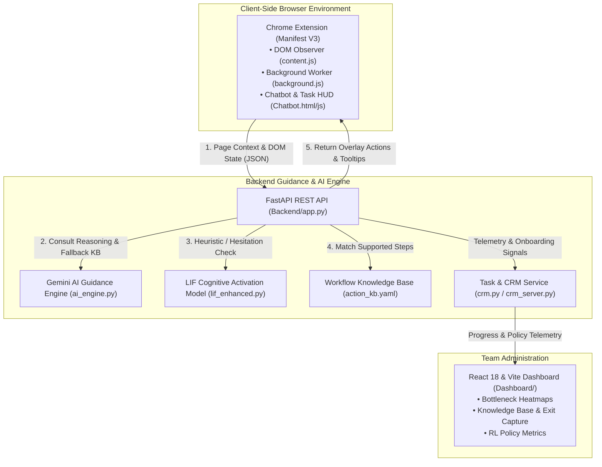
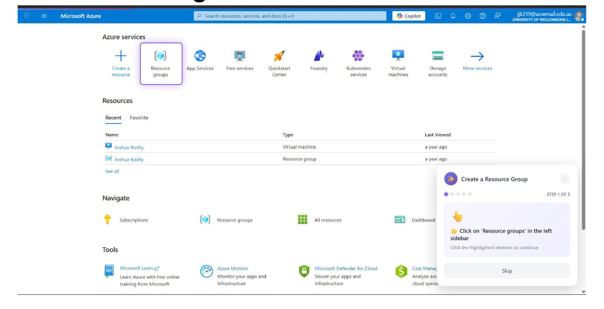
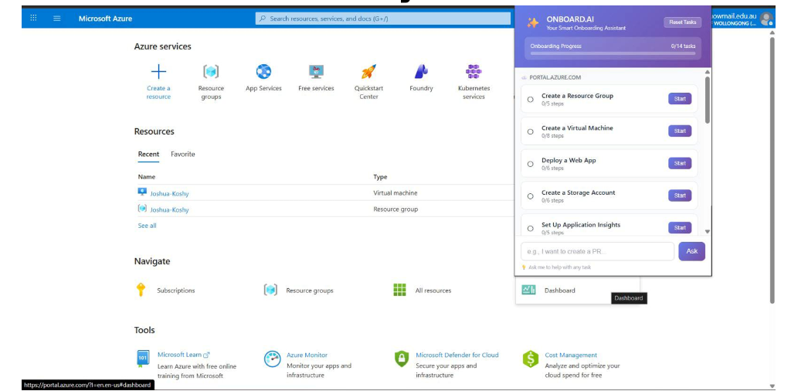
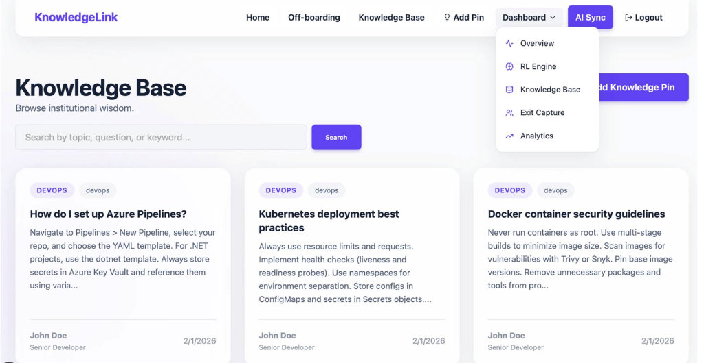

# OnStack

> AI-powered onboarding assistant that delivers real-time context detection, LLM-driven guidance, and interactive visual step-by-step overlays directly on developer platforms.

---

> [!NOTE]
> **Active Startup Project:** OnStack is an active developer-tools startup co-founded by **Mayank Tadepalli**, **Sadeem Mehkery**, and **Joshua Koshy**, designed to eliminate engineering ramp-up friction and accelerate developer velocity.

---

## Overview

Engineering onboarding is notoriously fragmented. New hires spend weeks parsing outdated internal wikis, context-switching between chat threads, and struggling through unfamiliar cloud consoles, DevOps tooling, and code-review workflows on platforms like Microsoft Azure, GitHub, Jira, and Slack.

**OnStack** solves this ramp-up bottleneck by turning the browser into an intelligent, interactive co-pilot. As developers navigate their daily toolchain, OnStack observes the live DOM context, understands their current onboarding task, and dynamically renders targeted visual highlight boxes, actionable tooltips, and step-by-step walkthroughs directly on the webpage. Supported by an administrative management dashboard and an LLM-driven adaptive guidance engine, engineering teams can track onboarding velocity, identify common workflow friction points, and preserve institutional knowledge effortlessly.

---

## System Architecture

OnStack is engineered as a distributed multi-component platform comprising three core pillars:



### 1. `Extension/` — Client-Side Context Observer & Overlay Injector
- **Chrome Manifest V3 Architecture:** Operates with a lightweight background service worker (`background.js`) and high-performance content script (`content.js`).
- **Real-Time DOM Inspection:** Monitors active web applications (Azure Portal, GitHub, Slack, Atlassian/Jira, Figma), serializes visible text, active elements, and page URLs, and transmits context packets to the backend.
- **Visual HUD & Element Pinpointing:** Dynamically injects pulsating highlight boxes, anchor pointers, and interactive guidance tooltips directly over target DOM selectors (e.g., resource creation buttons, PR merge dropdowns).
- **Interactive Assistant UI:** Embeds a standalone slide-out chatbot (`Chatbot.html` / `Chatbot.js`) and quick-action menu (`popup.html`) allowing engineers to query workflows in natural language or toggle autonomous guidance.

### 2. `Backend/` — Dual-Core Guidance & Intelligence Engine
- **Hybrid AI Engine:** Powered by Google Gemini (`gemini-2.5-flash` via `ai_engine.py`) for generative reasoning and fallback rule-based knowledge retrieval (`action_kb.yaml` + `guidance_generator.py`).
- **LIF Activation Dynamics:** Features a biologically-inspired Leaky Integrate-and-Fire (`lif_enhanced.py`) cognitive thresholding model to predict when a developer is blocked and automatically trigger proactive guidance.
- **Task & CRM Orchestration:** Integrates with team management APIs (`crm.py` / `crm_server.py`) to manage employee onboarding paths, track task completions, and log step durations.

### 3. `Dashboard/` — Engineering Team & Analytics Dashboard
- **Executive Overview & Heatmaps:** Displays onboarding bottleneck heatmaps, step drop-off rates, and live feedback signals across repositories and toolchains.
- **Adaptive Policy & Knowledge Center:** Manages reinforcement learning guidance policies, pinned workflow documentation, and offboarding knowledge capture modules.

---

## Tech Stack

| Component | Technology | Description |
|---|---|---|
| **Backend API** | Python 3.10+, [FastAPI](https://fastapi.tiangolo.com/), Uvicorn | High-throughput asynchronous REST API |
| **Data & Schemas** | Pydantic v2, Pydantic-Settings, PyYAML | Context validation and structured knowledge base parsing |
| **AI & Reasoning** | Google Generative AI (Gemini 2.5 Flash), OpenAI | Contextual step generation and DOM reasoning |
| **Cognitive Modeling** | Python NumPy, Custom LIF Model | Adaptive developer hesitation detection |
| **Management Dashboard** | React 18, [Vite](https://vitejs.dev/), [Lucide React](https://lucide.dev/) | High-performance engineering administration SPA |
| **Styling** | Tailwind CSS / Custom CSS | Modern dark-themed dashboard interface |
| **Browser Extension** | Chrome Extensions (Manifest V3), Vanilla JavaScript | Cross-platform web overlay and DOM observer |

---

## Setup & Installation

### Prerequisites
- Python 3.10+
- Node.js 18+ and npm
- Google Chrome or any Chromium-based browser

---

### 1. Backend Service Setup

```bash
# Clone the repository
git clone https://github.com/mayankt411/OnStack.git
cd OnStack

# Create and activate a Python virtual environment
python -m venv .venv

# Windows (PowerShell):
.venv\Scripts\Activate.ps1

# Linux / macOS:
# source .venv/bin/activate

# Install backend dependencies
pip install -r requirements.txt

# (Optional) Launch the mock CRM server in a separate terminal
python crm_server.py
```

To run the main OnStack guidance backend:

```bash
cd Backend
uvicorn app:app --host 0.0.0.0 --port 8000 --reload
```

---

### 2. Management Dashboard Setup

```bash
# Navigate to the Dashboard directory
cd Dashboard

# Install frontend dependencies
npm install

# Launch the Vite development server
npm run dev
```

Open `http://localhost:5173` in your browser to access the OnStack administrative dashboard.

---

### 3. Chrome Extension Local Installation

1. Open Google Chrome and navigate to `chrome://extensions/`.
2. Toggle the **Developer mode** switch in the top-right corner.
3. Click **Load unpacked**.
4. Select the `Extension/` directory located inside the `OnStack` repository folder.
5. The **OnStack Onboarding Assistant** icon will now appear in your browser toolbar. Open any supported cloud portal or repository (e.g., `https://portal.azure.com` or `https://github.com/new`) to experience real-time onboarding guidance overlays.

---

## Screenshots

### 1. In-Browser Step-by-Step Guidance Overlay
Target element pinpointing with dynamic tooltip guidance assisting an engineer through cloud provisioning:



---

### 2. OnStack Assistant Extension & Active Tasks
Slide-out extension assistant providing task roadmaps, step counters, and natural language query assistance:



---

### 3. Team Knowledge Base & Administrative Dashboard
Centralized organizational knowledge repository with curated best practices, exit capture distillation, and telemetry:



---

## Repository Structure

```
Onstack/
├── Backend/
│   ├── action_kb.yaml          # Structured YAML knowledge base of supported workflows
│   ├── action_matcher.py       # Heuristic and fuzzy action matching algorithms
│   ├── ai_engine.py            # Gemini 2.5 Flash LLM reasoning integration
│   ├── app.py                  # Core FastAPI application, routes, and REST endpoints
│   ├── crm.py                  # CRM connection client and employee progress synchronization
│   ├── guidance_generator.py   # Step synthesizer mapping DOM context to overlay actions
│   └── lif_enhanced.py         # Leaky Integrate-and-Fire adaptive cognitive activation model
├── Dashboard/
│   ├── src/
│   │   ├── App.jsx             # React dashboard root component with tabs and heatmaps
│   │   └── main.jsx            # React DOM mounting entry point
│   ├── index.html              # Dashboard HTML template with Tailwind CSS
│   ├── package.json            # Frontend dependencies (React 18, Vite, Lucide)
│   └── vite.config.js          # Vite build and server configuration
├── Extension/
│   ├── background.js           # Chrome Manifest V3 service worker
│   ├── Chatbot.html            # Slide-out onboarding co-pilot chat window
│   ├── Chatbot.js              # Chat interface logic and backend communication
│   ├── content.js              # DOM observer and interactive tooltip/overlay renderer
│   ├── manifest.json           # Chrome extension configuration and permissions
│   ├── popup.html              # Extension toolbar popup interface
│   └── popup.js                # Toolbar action handlers and active task overview
├── images/
│   ├── extension_step_guidance_overlay.png
│   ├── extension_assistant_popup.png
│   └── management_knowledge_dashboard.png
├── crm_server.py               # Standalone mock CRM API server for employee task management
├── requirements.txt            # Python dependencies
├── .gitignore                  # Git ignore rules (venv, node_modules, cache, envs)
├── LICENSE                     # MIT License
└── README.md                   # Comprehensive project documentation
```

---

## License

This project is licensed under the [MIT License](LICENSE).
